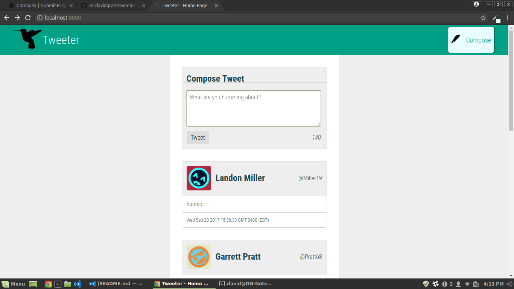
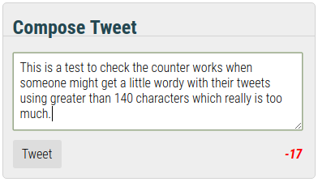
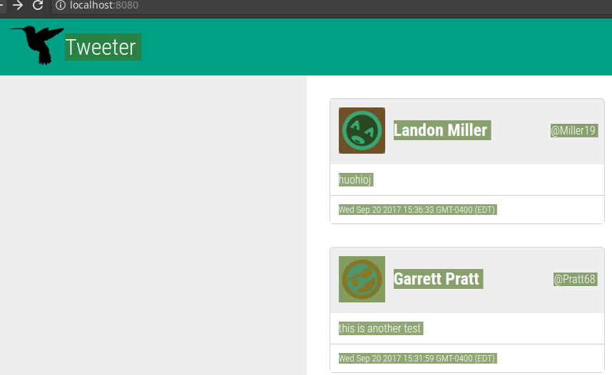

# Tweeter Project

Tweeter is a simple, single-page Twitter clone.

This was forked from lighthouse-labs/tweeter, with the objective of building a simple Twitter clone using a persistent database.

> Currently running from heroku at https://rocky-depths-69904.herokuapp.com/
> Likes have been implemented, not not on a user logged in basis, as logins have not yet been implemented.
> CSS is SASS compiled.

## Getting Started

1. Fork this repository, then clone your fork of this repository.
2. Install dependencies using the `npm install` command.
3. Start the web server using the `npm run local` command. The app will be served at <http://localhost:8080/>.
4. Go to <http://localhost:8080/> in your browser.

## Dependencies

- "body-parser": "^1.15.2",
- "chance": "^1.0.2",
- "dotenv": "^4.0.0",
- "express": "^4.13.4",
- "md5": "^2.1.0",
- "method-override": "^2.3.9",
- "mongodb": "^2.2.31",
- "morgan": "^1.8.2",
- "path": "^0.12.7"

## Screenshots
### Screenshot of whole screen with compose box

### Screenshot of compose box with too many letters

### Screenshot of logo and navbar

